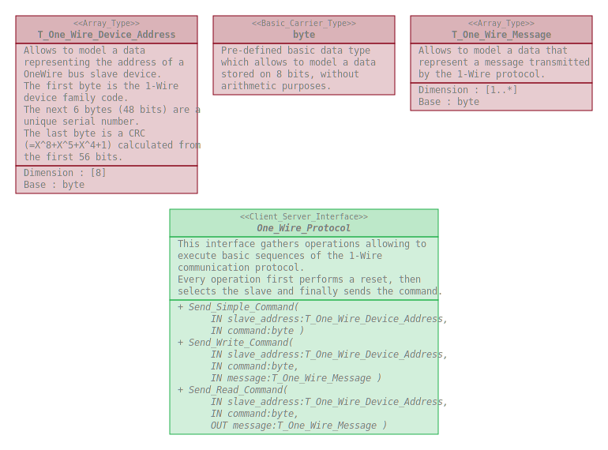

# One_Wire_Interfaces

This repository defines a package gathering software elements allowing to manage
the 1-Wire communication protocol.

## Overview

## Dependencies

None.

## Use

### With the Arduino IDE

This repository shall be clone within the _libraries_ folder of the _Arduino
sketchbook folder_.
